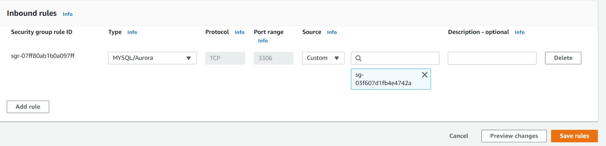
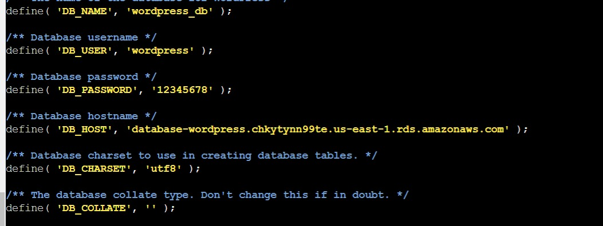

# Install Wordpress on AWS with RDS

---

Prerequisites: **A personal Aws account**

---

## 1. Step: Creating a MySQL Database with Amazon RDS

- Enter RDS in the search bar, then select RDS to open the service console.
  

- Click on the button that says "Create database"

- Now we need to choose the "**_standard create_**" option and "**_MySQL_**" as our database

**_In the Templates section of the creation wizard, there is an option to only show options that are available in the AWS Free Tier. Select this option to complete the learning in this guide without incurring costs._**

- Next, you will specify the authentication settings for your MySQL deployment. These include the database name and the master username and password.


- All the options that are after the last one we are going to keep with the default values except for this one below, we need to add that "initial database name" on this additional configuration and we are going to add "wordpress" as our initial name .
  

- Then click the button that says "**Create database**" at the end.

- **_You should see a success notice indicating that your database is being created._**
  

---

## 2. Creating an EC2 Instance

- Enter EC2 in the search bar, then select EC2 dashboard to open the service and click on the button that says "**Launch an instance**".

- Enter wordpress app as your instance name.

- Choose ubuntu as your machine image
- The "**instance type**" will be the default value which it is "**_t2.micro_**"

- **You will see a details page on how to configure a key pair for your instance. You will use the key pair to SSH into your instance, which will give you the ability to run commands on your server.**

  - Open the key pair (login) section and choose Create new key pair for your instance.

  

  - Give your key pair a name. Then choose the Create key pair button, which will download the .pem file to your machine. You will use this file in the next module.
    

- Configuring a security group and launching your instance
  

- Finally, you can launch your instance

---

## 3. Configuring Your Amazon RDS Database

- First, you will modify your Amazon RDS database to allow network access from your EC2 instance.

      - So enter RDS again in the search bar and go to all your databases instances and we are going to click in the one we have just created few minutes ago

  

- Now we click on "**_Security -> default('your instance number') ->Inbound rules ->Edit inbound rules(at the bottom)_** "
   - **Whe are going to choose _MYSQL/Aurora and we need our security group name on the right (in the picture below my security group name is sg-03f607d1fb4e4742a if you don't know your security group name go to the instance settings and in the security options you will be able to see it)_**
  

- Click the button that says "save rules" and you are go to go

- Now that your EC2 instance has access to your Amazon RDS database, you will use SSH to connect to your EC2 instance and run some configuration commands.

  Previously, you downloaded the .pem file for the key pair of your instance. Locate that file now. It will likely be in a Downloads folder on your desktop.

  Open a terminal window. If you are on a Mac, you can use the default Terminal program that is installed, or you can use your own terminal.

  In your terminal, run the following commands to use SSH to connect to your instance. Replace the “<path/to/pem/file>” with the path to your file, e.g., “~/Downloads/wordpress.pem”, and the “<publicIpAddress>” with the public IP address for your EC2 instance.

  ```
  chmod 400 <path/to/pem/file>
   ssh -i <path/to/pem/file>ec2-user@<public_IP_DNSAddress>
  ```

  You should see the following in your terminal to indicate that you connected successfully:
  

**For Windows users:**

You will need to use PuTTY, an SSH client for Windows, to connect to your EC2 instance. For instructions on doing this, see this guide for Connecting to your Linux instance from Windows using PuTTY. You will need the .pem file you downloaded and the public IP address of your EC2 instance.
In this step, you connected to your EC2 instance using SSH. In the next step, you will connect to your Amazon RDS database from your EC2 instance and create a database user for the WordPress application.

##### Now create a database user

- First we need to install mysql-client

  ```
  sudo apt-get install mysql-client
  ```

- Now Go to the Amazon RDS databases page in the AWS console. You should see the wordpress database you created for the WordPress installation. Select it to find the hostname for your Amazon RDS database.

- In the details of your Amazon RDS database, the hostname will be shown as the Endpoint in the Connectivity & security section.


- Now Copy that endpoint and execute the following command

```
mysql –u admin –p –h ('your endpoint here').us-east-1.rds.amazonaws.com

```

- Finally, create a database user for your WordPress application and give the user permission to access the wordpress database.

Run the following commands in your terminal:

```
CREATE DATABASE (db name here);
CREATE USER 'wordpress' IDENTIFIED BY 'wordpress-pass';
GRANT ALL PRIVILEGES ON wordpress.* TO wordpress;
FLUSH PRIVILEGES;
Exit
```

---

## 4. Configuring WordPress on EC2

- **First we need to install apache server, To install Apache on your EC2 instance, run the following command in your terminal:**

```
sudo apt install apache2
```

Go to the EC2 Instances page and find your instance. In the Description below, find the Public IPv4 DNS of your instance. You should see something like this:


- Now, let's download and configure WordPress. In this step, you will download the WordPress software and set up the configuration.

First, download and uncompress the software by running the following commands in your terminal:

```
wget https://wordpress.org/latest.tar.gz
tar -xzf latest.tar.gz
```

Change the directory to the wordpress directory and create a copy of the default config file using the following commands:

```
cd wordpress
cp wp-config-sample.php wp-config.php

```

- Then, open the wp-config.php file using the nano editor by running the following command.

```
nano wp-config.php
```

First, edit the database configuration by changing the following lines:

```

// ** MySQL settings - You can get this info from your web host ** //
/** The name of the database for WordPress */
define( 'DB_NAME', 'database_name_here' );

/** MySQL database username */
define( 'DB_USER', 'username_here' );

/** MySQL database password */
define( 'DB_PASSWORD', 'password_here' );

/** MySQL hostname */
define( 'DB_HOST', 'localhost' );

```

The values should be:

- DB_NAME: “wordpress”
- DB_USER: The name of the user you created in the database in the previous module
- DB_PASSWORD: The password for the user you created in the previous module
- DB_HOST: The hostname of the database that you found in the previous module



**Now you can save the changes**

###### -**Deploying wordpress**

You need to move the wordpress directory to the apache 2 directory and you can do it by running the following commands

```
sudo mv wordpress /var/www
cd /var/www
sudo mv html html.old
sudo mv wordpress html
sudo chown –R www-data:www-data html

```

# END

you should see the installation wordpress page in your url with your ip address
